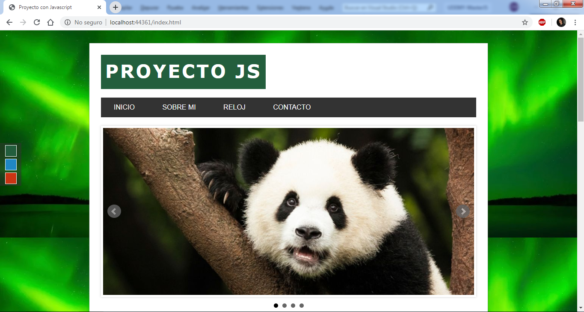
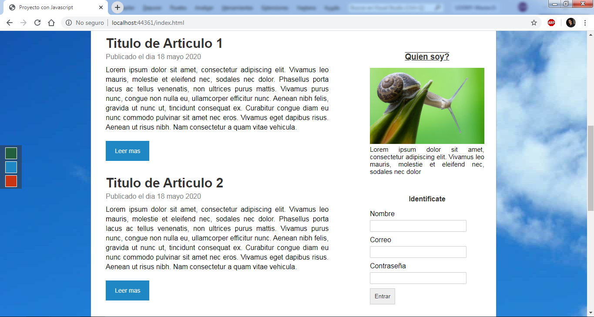
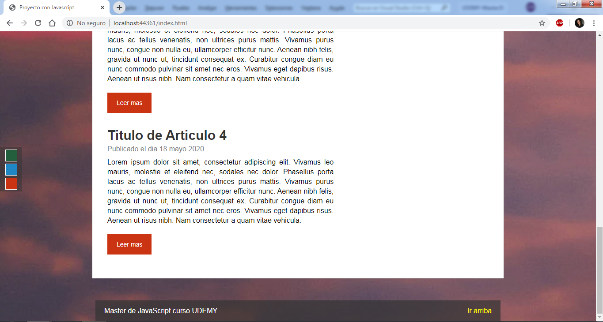

# MasterJavascript-Udemy

Realizada utilizando HTML5, CSS3 y JavaScript mediante el uso de JQuery,JSON y otros plugins.
Es una aplicacion web creada a traves del curso de Master en Javascript de Udemy.

## Vistas

 

 

 
